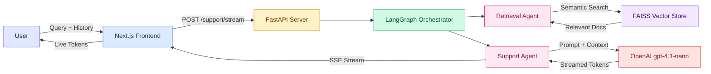

# 🛠️ GenAI Multi-Agent Support Backend

### FastAPI • LangGraph • LangChain • FAISS • RAG • Streaming SSE

This backend powers an AI-driven **technical support assistant** using a multi-agent architecture and a Retrieval-Augmented Generation (RAG) pipeline.
It retrieves relevant troubleshooting content and generates intelligent, step-by-step resolutions — with real-time streaming.

---

## 🏗️ Architecture



---

## 🚀 Features

### 🔹 Multi-Agent Architecture
- **Retrieval Agent** — Retrieves relevant documents using FAISS
- **Support Agent** — Produces human-like troubleshooting responses
- Agents orchestrated using **LangGraph** workflow execution

### 🔹 RAG (Retrieval-Augmented Generation)
- Embeddings generated with OpenAI Embeddings API
- Vector search using **FAISS** over 14 troubleshooting guides
- Supports Markdown-based troubleshooting files

### 🔹 Streaming Responses (SSE)
- `POST /support/stream` — Real-time token streaming via Server-Sent Events
- Tokens appear word-by-word in the frontend for a ChatGPT-like experience

### 🔹 Conversation Memory
- Accepts message history for context-aware follow-up questions
- Maintains last 6 messages for optimal context window usage

### 🔹 Production Features
- Rate limiting via slowapi (20 req/min per IP)
- Health check endpoint (`GET /health`)
- CORS configured via environment variables
- Pinned dependency versions

---

## 📁 Project Structure

```
app/
  agents/
    retrieval_agent.py    # FAISS document retrieval
    support_agent.py      # LLM response generation + streaming
  rag/
    index_builder.py      # FAISS index builder
    retriever.py          # RAG retriever wrapper
  graph/
    support_graph.py      # LangGraph workflow orchestration
  api/
    server.py             # FastAPI endpoints
  data/
    docs/                 # 14 troubleshooting guides
    faiss_index/          # Generated FAISS index
tests/
  test_api.py             # API endpoint tests
main.py
Dockerfile
render.yaml
requirements.txt
```

---

## 🔧 Environment Variables

Create **.env**:

```
OPENAI_API_KEY=your-key
MODEL_NAME=gpt-4.1-nano
DOCS_PATH=app/data/docs
ALLOWED_ORIGINS=http://localhost:3000,http://localhost:3737
```

---

## 🏗️ Run Locally

Install dependencies:

```bash
pip install -r requirements.txt
```

Build the FAISS index:

```bash
python3 -m app.rag.index_builder
```

Start the server:

```bash
uvicorn app.api.server:app --reload
```

Open Swagger docs: 👉 http://127.0.0.1:8000/docs

---

## 🐳 Run with Docker

```bash
docker build -t netsupport-api .
docker run -p 8000:8000 -e OPENAI_API_KEY=your-key netsupport-api
```

Or use docker-compose from the root directory:

```bash
docker-compose up
```

---

## 🧪 Run Tests

```bash
pytest tests/ -v
```

---

## 🧰 Technologies

- FastAPI + Uvicorn
- LangChain + LangGraph
- FAISS (vector search)
- OpenAI (gpt-4.1-nano)
- SlowAPI (rate limiting)
- Python 3.11
- Docker
- Pytest

---

## ☁️ Deployment

Deployed on **Render**: 👉 https://genai-multi-agent-support.onrender.com

---
